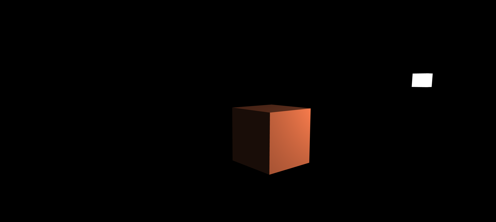
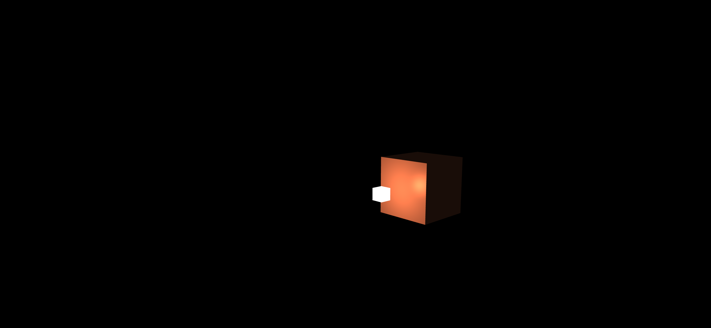
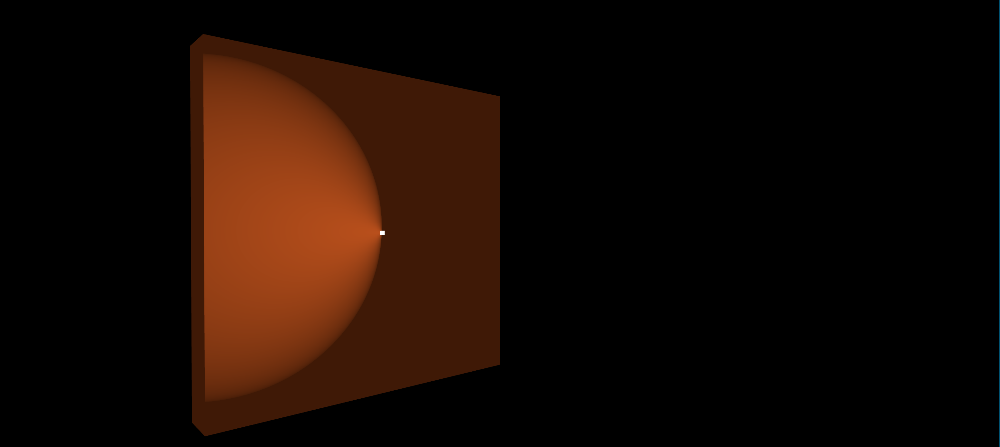
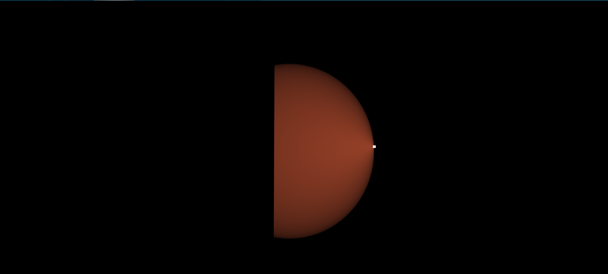
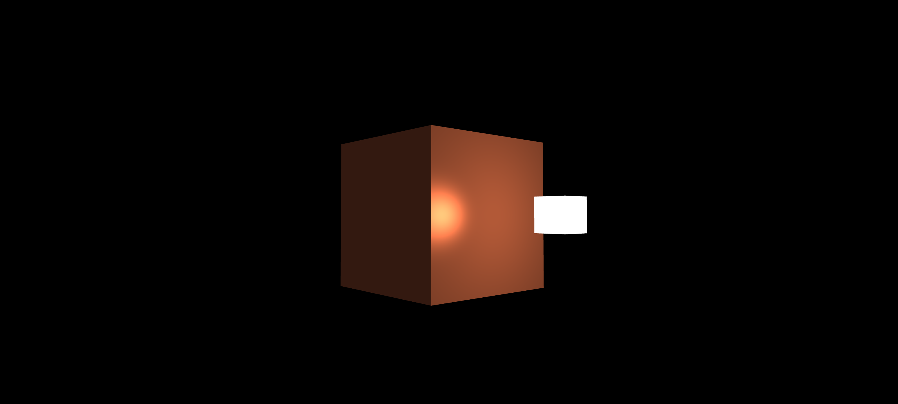
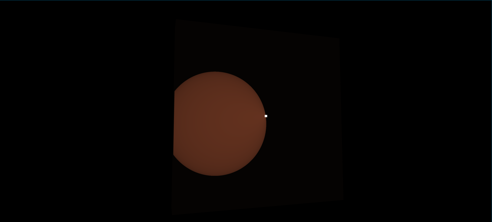
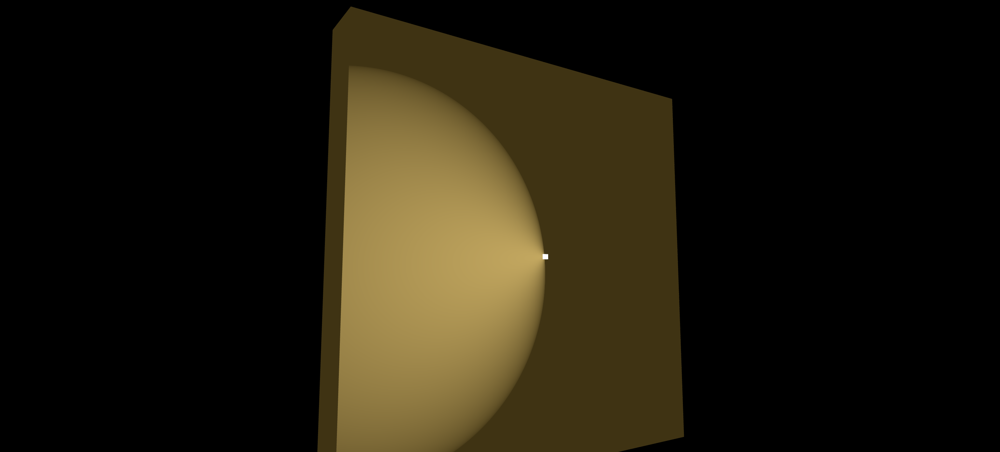
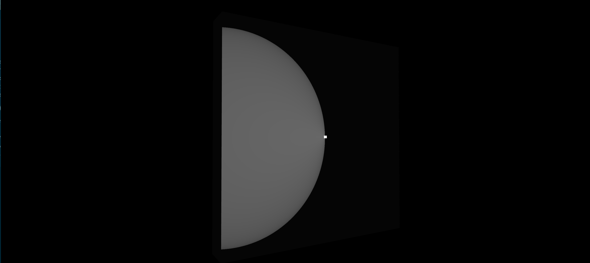

# Lighting
<!-- mtoc-start -->

* [Phong Model](#phong-model)
  * [Ambient lighting](#ambient-lighting)
  * [Diffuse lighting](#diffuse-lighting)
  * [Specular lighting](#specular-lighting)
    * [Missunderstanding specular reflection math](#missunderstanding-specular-reflection-math)
    * [Getting weird specular highlights for materials](#getting-weird-specular-highlights-for-materials)
      * [gold](#gold)
      * [red-plastic](#red-plastic)
      * [custom material](#custom-material)
      * [black rubber](#black-rubber)
    * [Found the bug in the code](#found-the-bug-in-the-code)
      * [Gold](#gold-1)
      * [Black Rubber](#black-rubber-1)
  * [Debugging lighting code](#debugging-lighting-code)

<!-- mtoc-end -->

## Phong Model
- Lighting models help simulate real world in limited resources
- Phong lighting model - three components
  - Ambient - It's never completely dark, it's the moonlight in the night
  - Diffuse - Directional impact of light
  - Specular - Simulates bright spots on shiny objects, more inclined towards the color of light than the color of object

### Ambient lighting
- Comes from many sources
- Doesn't have to be direct light, can be the reflected one, global illumination algorithms help with that.
- In code we define some light color and use a fraction of that as the ambient light `ambient_strength` is what we call that fraction.

### Diffuse lighting
- Comes from a light source, falls at an angle, the more angle it falls at, the smaller it's impact
- We need normal at the point it falls and the directed ray and then using cos, we can find it's impact
- Dot at 0 is 1 and at 90 is 0, so the ray falling perpendicular has the most impact
- We should ideally use unit vectors otherwise as we can see from formula v.u = |v|.|u|.cosθ, the magnitudes get multiplied
- Normal vector is a unit vector perpendicular to the surface of a vertex,
  we pass the normals with the vertices, `but i don't know if they should be
  in world space, i think probably, but the tutorial didn't convert them`
- Then we need the direction vector from the fragment to the light, for that
  we need the fragment position which we pass from the vertex shader to the
  fragment shader (after multiplying with model matrix since that converts
  that to world space). all these calculations happen in world space. the
  light position is in world space.
- For a cube the position for each fragment will likely be just a vertex's
  position and that means that the normal would also be a vertex's normal,
  therefore each face will have a uniform shading and not based on per pixel
  position. 

- later in the tutorial they said yes we should convert the normal to world
  space but it's not that simple as multiplying with model matrix. normals
  are direction only vectors, don't have the w component, the homogeneous
  coordinate. this means that translations won't have any impact `(how?)`.
  another issue is that when we apply non uniform scale, the normal changes
  direction. uniform scale only changes magnitude which can be fixed with
  normalization.

- so we use a new model matrix for normals called `normal matrix` this
  article <http://www.lighthouse3d.com/tutorials/glsl-tutorial/the-normal-matrix/> explains
  how this is created. this should not be done in  shader code though,
  matrix operations are expensive in shader.

- i applied some scaling transforms to the cube to find out if the normals
  would change and i found that the part close to the light was brighter
  than the rest. this wasn't the case when the light was far away as every
  face seemed uniformly shaded. as it turns out, thanks to nitrix's help on
  irc, everything vertex related gets interpolated in the fragment shader
  and thus the position was getting interpolated and that changed the angle
  and thus was brighter close to the light. 

- if things get confusing then think in terms of the good old triangle, it's
  a nice debugging tactic, what's valid for a triangle is also valid for a
  whole model and vice versa. that makes things easy.

### Specular lighting
- it's like the diffuse lighting, depends on light direction and the normal,
  but this time it takes into consideration the camera position, the
  observer's position.

- based on reflective properties of surface
- it's strongest where the light is reflected from the surface angle i = angle r
- smaller the angle between view and reflected light, stronger the effect
- we need viewer's position in world space to find the view vector.

> [!NOTE] 
> people prefer to do lighting calculations in view space as there they get
> the viewer's position for free i.e. (0,0,0).

- the reflect function takes the light vector as if it were an incident ray,
  so maybe the unit_light_position needs a - sign.


- stepping through the code and abstracting away calculations to get to a
  rough understnading of what's going on actually helps understand the
  concept. like here i went through the specular calculation and it all
  boiled down to `some_number * light_color` => integer multiple of the
  light's color... amplified light color.

- as nitrix explained, it's nothing fancy, all these textures and maps are
  just data and then there are formulas like the one below and when zoomed
  out like i did above by bundling things together into abstract boxes, it's
  not that hard to relate that to the basics. specular basically reflects the
  light color multiplied certain times. 

- but how can that be true, a mirror is basically  a true reflector and that
  reflects 100% of the light as it gets that... i don't understand. let's try
  by changing these values and see how things change.
```glsl
        float specular_strength   = 0.5;  // this is ideally a property of the material.
        vec3  unit_view_direction = normalize(camera_position - position);
        /* here the light direction is negative because previously we calculated it from fragment to light
         * for the dot product, but reflect expects it to be from source to fragment like any incident ray */
        vec3 unit_reflected_direction = normalize(reflect(-unit_light_direction, normal));
        /* the tutorial says that this power of 32 thing is the shininess value of highlight, higher this
         * value, higher light gets reflected. so we are essentially raising 32 to the power of a number between
         * 0 and 1. so at max the value will be 32 and at least 1. spec = [1, 32] */
        float specular = pow(max(dot(unit_view_direction, unit_reflected_direction), 0.0), 32);
        /* so half the light is reflected (0.5 = specular_strength) * a number from range [1, 32](= shininess_number let's say) * light_color */
        /* = 1/2 * shininess_number * light_color = (shininess_number/shininess_strength) * light_color = some multipe of light_color */
        vec3 specular_lighting = specular_strength * specular * light_color;

```

> [!NOTE] 
> last time i did the tutorial till here and then went away because
> apparently i thought i need to build a widget toolkit to be able to change
> values in real time and see them. that's a distraction and one should not
> change course like that, i could have used some keybinding to change some
> value and test things... it's hard to remain centered and make progress in
> one direction, once you do that, you actually complete things.


- also the code currently doesn't take into account the front and the back
  sides, so when i look at the cube from behind it, the specular spot
  actually is visible where it should not be 

- with the scaling removed from the cube, i am able to see the specular spot
  clearly. 

- <https://github.com/printfdebugging/learnopengl/commit/176ba32ffe9c01c32125a31437120dd51bf0ea3f> this is the commit
  where i applied some scaling to the cube and the specular spot is not
  visible. i think  this is because of the normal, i think it got scaled up non
  uniformly and that's why things are messed up. yeah, be it uniform or
  non-uniform scaling, the specular is not visible other than with 1 scaling.

- when there's some issue like this one, it's ideal to start with the working
  case and modify little little values and see how the thing goes from
  working to worst. that way one has some data points.

> [!ERROR]
> It's important to make sure that the code you are writing is actually what
> you have in your head ... and what you have in your head is actually what
> the code does, sometimes there are some typos in the code, like some
> matching/similar names and that often breaks things without us knowing.

> [!Hint]
> Also don't just complete the tutorial, mess up with it, have a mental model
> of how things are done and then try to verify that by changing values in
> the system. This way if there's some bug, you will catch it, and if you
> don't unerstand something, you will hit a wall and you will have to fill in
> the gaps. notes help... take logs. do something, take logs... in batches
> like 30m -> 5m logs, 30m -> 5m logs...

- thanks to minth on ##OpenGL for helping with it. As it turns out i by mistake
  used the original normal instead of unit_normal and that broke things.
  lesson learnt: make sure that the code is doing what you think, double
  check each line word by word and carefully say things out loud to see if
  they make sense.

- phong lighting model implemented in vertex shader is called gouraud shading
  instead of phong shading and it has a lot of interpolation and hence is
  less realistic

#### Missunderstanding specular reflection math

I increased this shininess value and as I did that the spot became smaller
and smaller. I did the math and drew some diagrams on paper and pen and as it
turned out, the spot should have grown bigger. But I did one thing wrong, I
thought  the pow(x,y) function in glsl is x^y but it's actually y^x where y
is the shininess and x is the dot product which is cos of the angle so it
remains between 0 and 1 and as y increasese i.e. the shininess increases,
this expression dimnishes really quickly as x goes from 1->0, that's why the
spot gets smaller and smaller.

> [!NOTE]
> Verify your assumptions, or otherwise you will keep searching for things
> and they would seem correct but you would miss out the obvious assumptions
> like `this library function must be working this way`, who knows, verify
> that.

#### Getting weird specular highlights for materials

##### gold

##### red-plastic

##### custom material

##### black rubber


I have defined some materials in `materials.h` and when i use them, i get
these weird specular highlights. Maybe they are weird when compared to the
real world objects, but not so much for phong model, maybe this is what
blin phong fixes as shown in this image 


```c

    [COPPER]         = { (vec3s) { 0.19125, 0.0735, 0.0225 },      (vec3s) { 0.7038, 0.27048, 0.0828 },      (vec3s) { 0.256777, 0.137622, 0.086014 },       0.1        },
    [GOLD]           = { (vec3s) { 0.24725, 0.1995, 0.0745 },      (vec3s) { 0.75164, 0.60648, 0.22648 },    (vec3s) { 0.628281, 0.555802, 0.366065 },       0.4        },
    [SILVER]         = { (vec3s) { 0.19225, 0.19225, 0.19225 },    (vec3s) { 0.50754, 0.50754, 0.50754 },    (vec3s) { 0.508273, 0.508273, 0.508273 },       0.4        },
    [BLACK_PLASTIC]  = { (vec3s) { 0.0, 0.0, 0.0 },                (vec3s) { 0.01, 0.01, 0.01 },             (vec3s) { 0.50, 0.50, 0.50 },                   0.25       },
    [CYAN_PLASTIC]   = { (vec3s) { 0.0, 0.1, 0.06 },               (vec3s) { 0.0, 0.50980392, 0.50980392 },  (vec3s) { 0.50196078, 0.50196078, 0.50196078 }, 0.25       },
    [GREEN_PLASTIC]  = { (vec3s) { 0.0, 0.0, 0.0 },                (vec3s) { 0.1, 0.35, 0.1 },               (vec3s) { 0.45, 0.55, 0.45 },                   0.25       },
    [RED_PLASTIC]    = { (vec3s) { 0.0, 0.0, 0.0 },                (vec3s) { 0.5, 0.0, 0.0 },                (vec3s) { 0.7, 0.6, 0.6 },                      0.25       },
    [WHITE_PLASTIC]  = { (vec3s) { 0.0, 0.0, 0.0 },                (vec3s) { 0.55, 0.55, 0.55 },             (vec3s) { 0.70, 0.70, 0.70 },                   0.25       },
    [BLACK_RUBBER]   = { (vec3s) { 0.02, 0.02, 0.02 },             (vec3s) { 0.01, 0.01, 0.01 },             (vec3s) { 0.4, 0.4, 0.4 },                      0.078125   },
```

#### Found the bug in the code
It seems that there was a bug in my shader code where I was using the
material properties to calculate the three lighting components and then
multiplied their sum with an object color (the orange from the last
section of the tutorial). That made everything look orange, even the black
rubber :).

##### Gold

##### Black Rubber


But the black rubber still look weird, i mean should it have such well
defined specular highlight boundary?

### Debugging lighting code

Often we make a few changes following the tutorial and the thing breaks
such that it's even hard to imagine what's going on with it. In such cases,
it's better to stash the changes and do it one step at a time, change
something, then verify that it works. And repeat that.
