<!-- mtoc-start -->

* [Lighting](#lighting)
  * [Phong Model](#phong-model)
    * [Ambient lighting](#ambient-lighting)
    * [Diffuse lighting](#diffuse-lighting)
    * [Specular lighting](#specular-lighting)
      * [Missunderstanding specular reflection math](#missunderstanding-specular-reflection-math)
      * [Getting weird specular highlights for materials](#getting-weird-specular-highlights-for-materials)
        * [gold](#gold)
        * [red-plastic](#red-plastic)
        * [custom material](#custom-material)
        * [black rubber](#black-rubber)
      * [Found the bug in the code](#found-the-bug-in-the-code)
        * [Gold](#gold-1)
        * [Black Rubber](#black-rubber-1)
      * [There was another bug](#there-was-another-bug)
    * [Debugging lighting code](#debugging-lighting-code)
  * [Lighting maps](#lighting-maps)
    * [Diffuse maps](#diffuse-maps)
      * [The diffuse map is not rendering on top and bottom faces](#the-diffuse-map-is-not-rendering-on-top-and-bottom-faces)
    * [Specular maps](#specular-maps)
      * [Specular light as a sin wave](#specular-light-as-a-sin-wave)
        * [at larger sine values](#at-larger-sine-values)
        * [when sine goes to 0 the rim becomes black](#when-sine-goes-to-0-the-rim-becomes-black)
        * [Actually that is correct](#actually-that-is-correct)
      * [Colored specular map](#colored-specular-map)
    * [Emission map](#emission-map)
      * [Emission map animation issue](#emission-map-animation-issue)
  * [Light casters](#light-casters)
    * [directional light](#directional-light)
    * [point lights](#point-lights)
      * [attenuation](#attenuation)
    * [spotlight](#spotlight)
      * [flashlight](#flashlight)
        * [special goggle effect](#special-goggle-effect)
* [Playing around](#playing-around)
  * [X-ray implementation](#x-ray-implementation)
    * [Xray Implementation details](#xray-implementation-details)
* [Debugging](#debugging)
  * [qrenderdoc](#qrenderdoc)

<!-- mtoc-end -->

# Lighting

## Phong Model
- Lighting models help simulate real world in limited resources
- Phong lighting model - three components
  - Ambient - It's never completely dark, it's the moonlight in the night
  - Diffuse - Directional impact of light
  - Specular - Simulates bright spots on shiny objects, more inclined towards the color of light than the color of object

### Ambient lighting
- Comes from many sources
- Doesn't have to be direct light, can be the reflected one, global illumination algorithms help with that.
- In code we define some light color and use a fraction of that as the ambient light `ambient_strength` is what we call that fraction.

### Diffuse lighting
- Comes from a light source, falls at an angle, the more angle it falls at, the smaller it's impact
- We need normal at the point it falls and the directed ray and then using cos, we can find it's impact
- Dot at 0 is 1 and at 90 is 0, so the ray falling perpendicular has the most impact
- We should ideally use unit vectors otherwise as we can see from formula v.u = |v|.|u|.cosθ, the magnitudes get multiplied
- Normal vector is a unit vector perpendicular to the surface of a vertex,
  we pass the normals with the vertices, `but i don't know if they should be
  in world space, i think probably, but the tutorial didn't convert them`
- Then we need the direction vector from the fragment to the light, for that
  we need the fragment position which we pass from the vertex shader to the
  fragment shader (after multiplying with model matrix since that converts
  that to world space). all these calculations happen in world space. the
  light position is in world space.
- For a cube the position for each fragment will likely be just a vertex's
  position and that means that the normal would also be a vertex's normal,
  therefore each face will have a uniform shading and not based on per pixel
  position. 

- later in the tutorial they said yes we should convert the normal to world
  space but it's not that simple as multiplying with model matrix. normals
  are direction only vectors, don't have the w component, the homogeneous
  coordinate. this means that translations won't have any impact `(how?)`.
  another issue is that when we apply non uniform scale, the normal changes
  direction. uniform scale only changes magnitude which can be fixed with
  normalization.

- so we use a new model matrix for normals called `normal matrix` this
  article <http://www.lighthouse3d.com/tutorials/glsl-tutorial/the-normal-matrix/> explains
  how this is created. this should not be done in  shader code though,
  matrix operations are expensive in shader.

- i applied some scaling transforms to the cube to find out if the normals
  would change and i found that the part close to the light was brighter
  than the rest. this wasn't the case when the light was far away as every
  face seemed uniformly shaded. as it turns out, thanks to nitrix's help on
  irc, everything vertex related gets interpolated in the fragment shader
  and thus the position was getting interpolated and that changed the angle
  and thus was brighter close to the light. 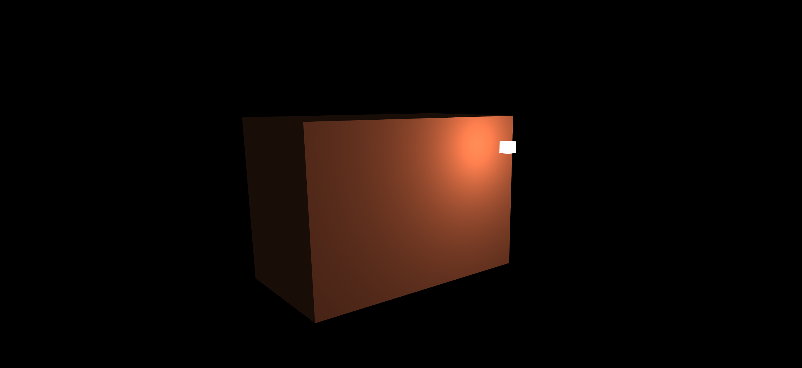

- if things get confusing then think in terms of the good old triangle, it's
  a nice debugging tactic, what's valid for a triangle is also valid for a
  whole model and vice versa. that makes things easy.

### Specular lighting
- it's like the diffuse lighting, depends on light direction and the normal,
  but this time it takes into consideration the camera position, the
  observer's position.

- based on reflective properties of surface
- it's strongest where the light is reflected from the surface angle i = angle r
- smaller the angle between view and reflected light, stronger the effect
- we need viewer's position in world space to find the view vector.

> [!NOTE] 
> people prefer to do lighting calculations in view space as there they get
> the viewer's position for free i.e. (0,0,0).

- the reflect function takes the light vector as if it were an incident ray,
  so maybe the unit_light_position needs a - sign.


- stepping through the code and abstracting away calculations to get to a
  rough understnading of what's going on actually helps understand the
  concept. like here i went through the specular calculation and it all
  boiled down to `some_number * light_color` => integer multiple of the
  light's color... amplified light color.

- as nitrix explained, it's nothing fancy, all these textures and maps are
  just data and then there are formulas like the one below and when zoomed
  out like i did above by bundling things together into abstract boxes, it's
  not that hard to relate that to the basics. specular basically reflects the
  light color multiplied certain times. 

- but how can that be true, a mirror is basically  a true reflector and that
  reflects 100% of the light as it gets that... i don't understand. let's try
  by changing these values and see how things change.
```glsl
        float specular_strength   = 0.5;  // this is ideally a property of the material.
        vec3  unit_view_direction = normalize(camera_position - position);
        /* here the light direction is negative because previously we calculated it from fragment to light
         * for the dot product, but reflect expects it to be from source to fragment like any incident ray */
        vec3 unit_reflected_direction = normalize(reflect(-unit_light_direction, normal));
        /* the tutorial says that this power of 32 thing is the shininess value of highlight, higher this
         * value, higher light gets reflected. so we are essentially raising 32 to the power of a number between
         * 0 and 1. so at max the value will be 32 and at least 1. spec = [1, 32] */
        float specular = pow(max(dot(unit_view_direction, unit_reflected_direction), 0.0), 32);
        /* so half the light is reflected (0.5 = specular_strength) * a number from range [1, 32](= shininess_number let's say) * light_color */
        /* = 1/2 * shininess_number * light_color = (shininess_number/shininess_strength) * light_color = some multipe of light_color */
        vec3 specular_lighting = specular_strength * specular * light_color;

```

> [!NOTE] 
> last time i did the tutorial till here and then went away because
> apparently i thought i need to build a widget toolkit to be able to change
> values in real time and see them. that's a distraction and one should not
> change course like that, i could have used some keybinding to change some
> value and test things... it's hard to remain centered and make progress in
> one direction, once you do that, you actually complete things.


- also the code currently doesn't take into account the front and the back
  sides, so when i look at the cube from behind it, the specular spot
  actually is visible where it should not be 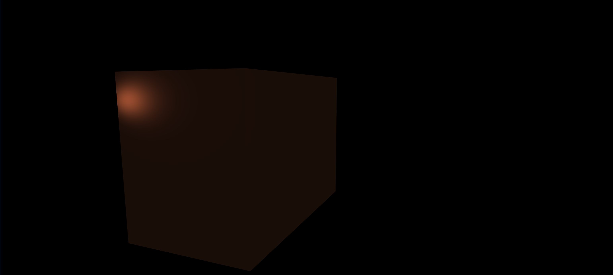

- with the scaling removed from the cube, i am able to see the specular spot
  clearly. 

- <https://github.com/printfdebugging/learnopengl/commit/176ba32ffe9c01c32125a31437120dd51bf0ea3f> this is the commit
  where i applied some scaling to the cube and the specular spot is not
  visible. i think  this is because of the normal, i think it got scaled up non
  uniformly and that's why things are messed up. yeah, be it uniform or
  non-uniform scaling, the specular is not visible other than with 1 scaling.

- when there's some issue like this one, it's ideal to start with the working
  case and modify little little values and see how the thing goes from
  working to worst. that way one has some data points.

> [!ERROR]
> It's important to make sure that the code you are writing is actually what
> you have in your head ... and what you have in your head is actually what
> the code does, sometimes there are some typos in the code, like some
> matching/similar names and that often breaks things without us knowing.

> [!Hint]
> Also don't just complete the tutorial, mess up with it, have a mental model
> of how things are done and then try to verify that by changing values in
> the system. This way if there's some bug, you will catch it, and if you
> don't unerstand something, you will hit a wall and you will have to fill in
> the gaps. notes help... take logs. do something, take logs... in batches
> like 30m -> 5m logs, 30m -> 5m logs...

- thanks to minth on ##OpenGL for helping with it. As it turns out i by mistake
  used the original normal instead of unit_normal and that broke things.
  lesson learnt: make sure that the code is doing what you think, double
  check each line word by word and carefully say things out loud to see if
  they make sense.

- phong lighting model implemented in vertex shader is called gouraud shading
  instead of phong shading and it has a lot of interpolation and hence is
  less realistic

#### Missunderstanding specular reflection math

I increased this shininess value and as I did that the spot became smaller
and smaller. I did the math and drew some diagrams on paper and pen and as it
turned out, the spot should have grown bigger. But I did one thing wrong, I
thought  the pow(x,y) function in glsl is x^y but it's actually y^x where y
is the shininess and x is the dot product which is cos of the angle so it
remains between 0 and 1 and as y increasese i.e. the shininess increases,
this expression dimnishes really quickly as x goes from 1->0, that's why the
spot gets smaller and smaller.

> [!NOTE]
> Verify your assumptions, or otherwise you will keep searching for things
> and they would seem correct but you would miss out the obvious assumptions
> like `this library function must be working this way`, who knows, verify
> that.

#### Getting weird specular highlights for materials

##### gold

##### red-plastic

##### custom material

##### black rubber


I have defined some materials in `materials.h` and when i use them, i get
these weird specular highlights. Maybe they are weird when compared to the
real world objects, but not so much for phong model, maybe this is what
blin phong fixes as shown in this image 


```c

    [COPPER]         = { (vec3s) { 0.19125, 0.0735, 0.0225 },      (vec3s) { 0.7038, 0.27048, 0.0828 },      (vec3s) { 0.256777, 0.137622, 0.086014 },       0.1        },
    [GOLD]           = { (vec3s) { 0.24725, 0.1995, 0.0745 },      (vec3s) { 0.75164, 0.60648, 0.22648 },    (vec3s) { 0.628281, 0.555802, 0.366065 },       0.4        },
    [SILVER]         = { (vec3s) { 0.19225, 0.19225, 0.19225 },    (vec3s) { 0.50754, 0.50754, 0.50754 },    (vec3s) { 0.508273, 0.508273, 0.508273 },       0.4        },
    [BLACK_PLASTIC]  = { (vec3s) { 0.0, 0.0, 0.0 },                (vec3s) { 0.01, 0.01, 0.01 },             (vec3s) { 0.50, 0.50, 0.50 },                   0.25       },
    [CYAN_PLASTIC]   = { (vec3s) { 0.0, 0.1, 0.06 },               (vec3s) { 0.0, 0.50980392, 0.50980392 },  (vec3s) { 0.50196078, 0.50196078, 0.50196078 }, 0.25       },
    [GREEN_PLASTIC]  = { (vec3s) { 0.0, 0.0, 0.0 },                (vec3s) { 0.1, 0.35, 0.1 },               (vec3s) { 0.45, 0.55, 0.45 },                   0.25       },
    [RED_PLASTIC]    = { (vec3s) { 0.0, 0.0, 0.0 },                (vec3s) { 0.5, 0.0, 0.0 },                (vec3s) { 0.7, 0.6, 0.6 },                      0.25       },
    [WHITE_PLASTIC]  = { (vec3s) { 0.0, 0.0, 0.0 },                (vec3s) { 0.55, 0.55, 0.55 },             (vec3s) { 0.70, 0.70, 0.70 },                   0.25       },
    [BLACK_RUBBER]   = { (vec3s) { 0.02, 0.02, 0.02 },             (vec3s) { 0.01, 0.01, 0.01 },             (vec3s) { 0.4, 0.4, 0.4 },                      0.078125   },
```

#### Found the bug in the code
It seems that there was a bug in my shader code where I was using the
material properties to calculate the three lighting components and then
multiplied their sum with an object color (the orange from the last
section of the tutorial). That made everything look orange, even the black
rubber :).

##### Gold

##### Black Rubber


But the black rubber still look weird, i mean should it have such well
defined specular highlight boundary?

#### There was another bug

The [website](http://devernay.free.fr/cours/opengl/materials.html) where I
copied the material properties from clearly says "multiply the shininess by
128". I missed that part and the tutorial didn't say that either, but it's
fine, nitrix pointed that out and now things look close to how they do in
real world.

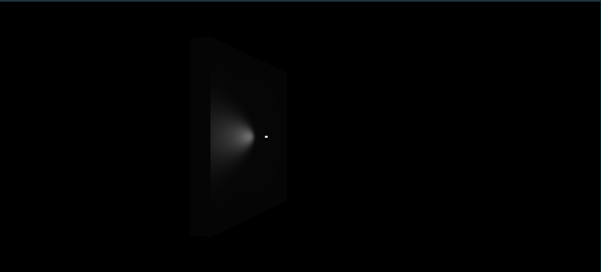
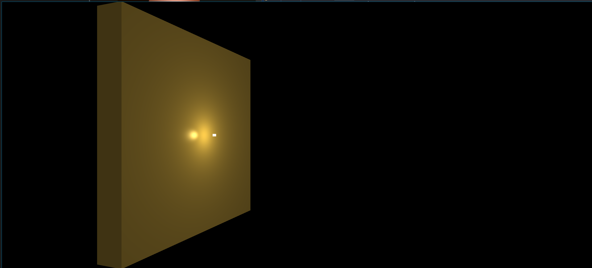

### Debugging lighting code

Often we make a few changes following the tutorial and the thing breaks
such that it's even hard to imagine what's going on with it. In such cases,
it's better to stash the changes and do it one step at a time, change
something, then verify that it works. And repeat that.

## Lighting maps
- Material properties are cool, but they aren't flexible (how)?
  - Objects in real world are made up of multiple materials.
  - A car has shiny mirrors/metal, rough tires/seats..
  - We need to extend it by introducing diffuse and specular maps
  - Help influence diffuse and specular components with more precision
  - Textures can store per fragment values, so these maps are essentially
    textures - image wrapped around the object which we can index.

The following sums it up really nicely. Basically these ambient, diffuse and
specular are properties of the object, of the surface. These are not
"lights", but rather how this object appears in light, how it reflects light
i.e. which parts of the light it absorbs and how much.

Then there are different formulas for calculating these effects, like diffuse
is just the cos of the angle of light direction with the normal (both unit
vectors), while specular does just that but for the camera's direction and
the reflected rays.
```txt
nitrix:  But it is true that the final fragment has "light", from three equations ambient/diffuse/specular, and it is true that your light sources will apply a factor on all of those.
nitrix:  printfdebugging, Basically, a better intuition for now, ambient is the scene environment constant light. The material determines diffuse+specular. Your lights are a multiplicative factor of those, but, intelligently (with angles and stuff).
nitrix:  printfdebugging, Your dress is red diffuse, if your light is 0, you get nothing visible.
nitrix:  printfdebugging, Your dress is red diffuse, if your light is vec3(0.2), you see the front of the dress red-ish, and the sides and back are dark.
nitrix:  printfdebugging, Similarly, Your dress is white diffuse, your light is a bit red vec3(0.2, 0.0, 0.0), same outcome visually.
nitrix:  Point is they multiply each others. Maybe it's easier if you think of lights as just white for now and as if they're just "factors" [0.0 ... 1.0] to determine how much of the diffuse you see.
```
### Diffuse maps
- In lit scenes this is usually called a `diffuse map`, what does the 'lit scene' mean here?
  - Does this mean that we take into account some fixed lights and basically
    avoid lighting calculations fro them by storing their values in the
    'diffuse map'?

> [!WARNING]
> `glms_translate` actually modifies the argument matrix and returns the same,
> so be cautious and always confirm what the function does.

#### The diffuse map is not rendering on top and bottom faces

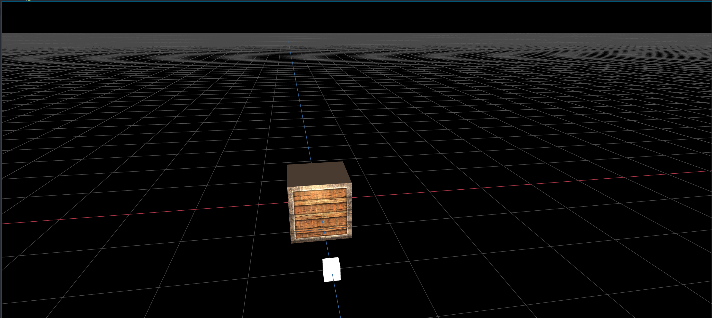

This is the [commit](https://github.com/printfdebugging/learnopengl/commit/70559c6c056af5d8c0316db5e1c100b4e28efd77) for this change. I updated the vertex/normal/uv arrays
with the latest opengl cube data as of this chapter. I wonder how should I
debug it. I quickly asked an LLM to verify the vertex data, it said "mostly
fine", then I did it manually on paper, found that the top face data is
actually clockwise, so I changed that to anticlockwise along with the uv
coords, but that didn't fix it either.

Just rendering the texture also gave the same result, so it's not the lighting
code either. Oh, I found the issue. I for some reason thought that there are
24 uv coordinates, I thought we used 36 for vertices and there were three
components, but here there are two components so 2/3 or 36 is 24 :) silly me.

How did I catch this?

> [!INFO]
> When there's an error like "texture not rendering for one face" i.e. a
> "some part not working" error, try to move that around, try to move the
> data around to maybe translate the error to other parts while fixing it
> for the initial case. This way one can gain insights into the nature of
> the error.
> 
> Like above, I thought what if I move the vertices around and when I did
> that, the texture rendered just fine on the top face, but it didn't on the
> back face and that was a signal that there's something wrong with the
> data. Then I looked more closely at the data and the loader code,
> questioned the assumptions and found the issue.


```c
mesh_load_uv(*model->mesh, uv, 24, 2 * sizeof(float));
```

### Specular maps

- Black and white textures with black -> white representing the intensity of
  light reflected by each part of the object.
- We don't use colors in a specular map because the color of the specular
  highlight mostly determined by the light's color.

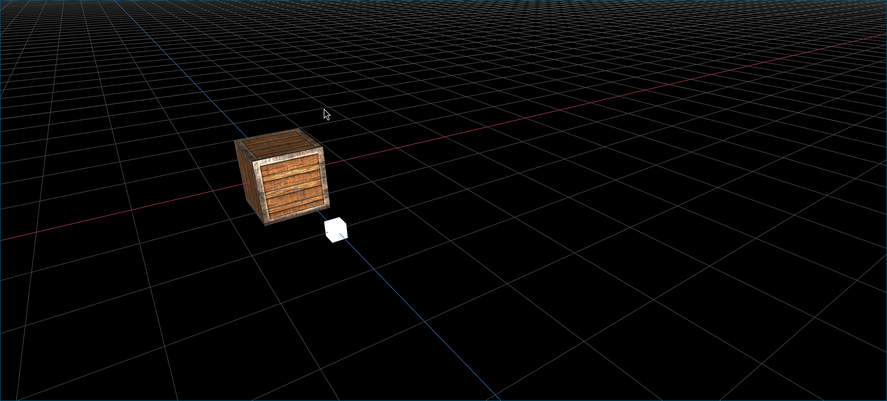

#### Specular light as a sin wave

I varied the specular component of the light as a sine wave i.e. it went
0 to 1 to 0 to 1 with time... and I noticed that when `light_sepcular`
approached 0, the color of the rim became black, which was darker than the
ambient color of the rim (as can be seen from parts which are not reflecting
specular light). I expected the rim to atleast look like it does under
ambient conditions when sine goes to 0. 

```c
double time = glfwGetTime();
vec3s light_specular = {
  sin(time),
  sin(time),
  sin(time),
};
```

##### at larger sine values
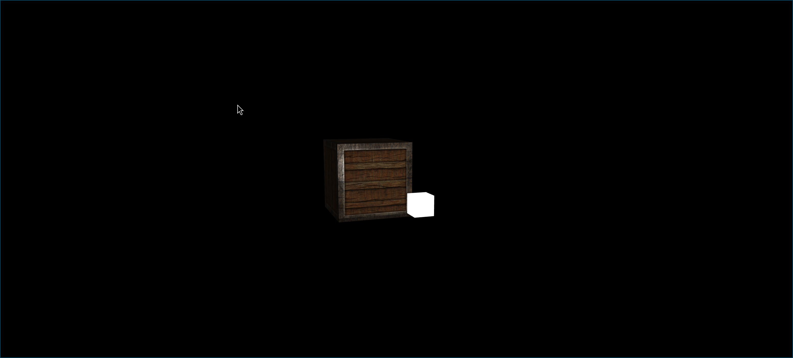

##### when sine goes to 0 the rim becomes black
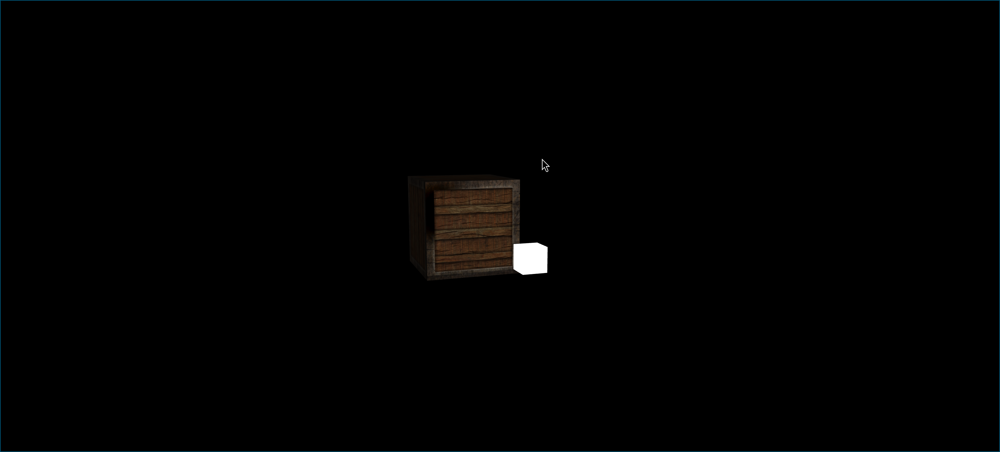


##### Actually that is correct

:) sine goes from -1 to 1, that's why it's like that. I thought it goes from
0 to 1, silly me. setting the specular light color to 0 gave the results as
expected, no specular highlights, just the same as with ambient and diffuse
lighting (i forgot the diffuse part above).

Also when we set the specular light color to something else, say blue, the
reflections are also blue, as expected.

#### Colored specular map
- These look unrealistic

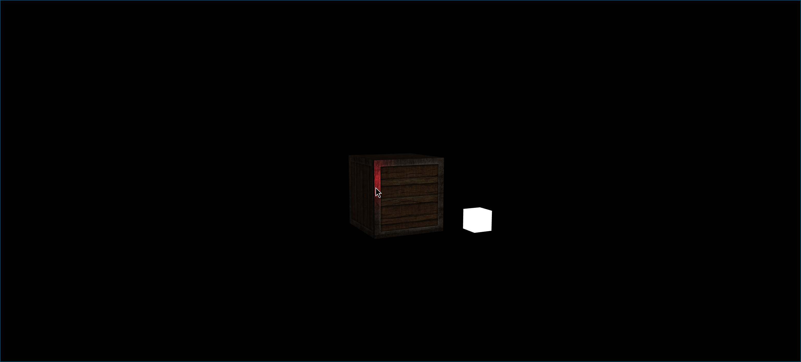

### Emission map
- Contains emission values per fragment
- Emission values are colors an object may emit as if it contains a light source itself.
- Like glowing eyes of a robot, light strips on a container etc.

The tutorial missed some part from the shader where we are to show the
emission texture in only the places where the specular map is black, but it
was easy to figure out.

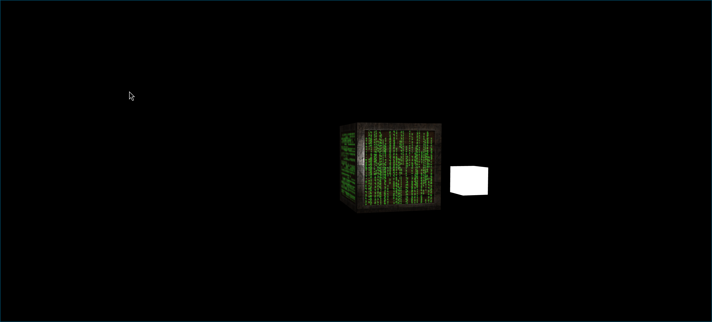

#### Emission map animation issue

I set the texture's s and t wraps to `GL_CLAMP_TO_EDGE` in `texture.c` and
then animated the texture using `uv + vec2(sin(time), 0.0f)`, it's fine when
the texture goes to the left, the right side remains clean, but when the
texture goes to the right, the left side has lines which I can't explain.

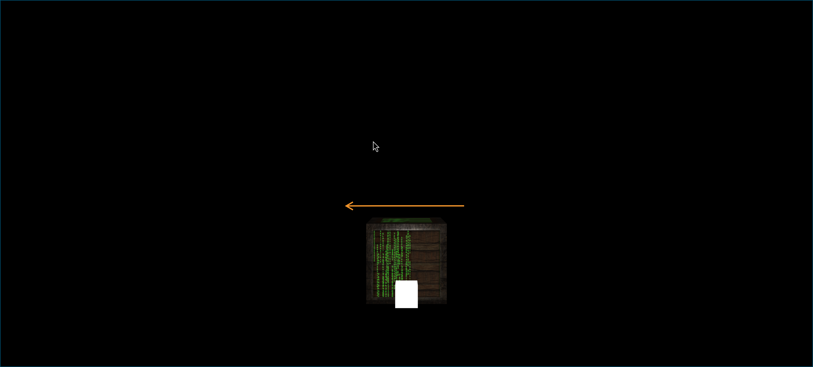
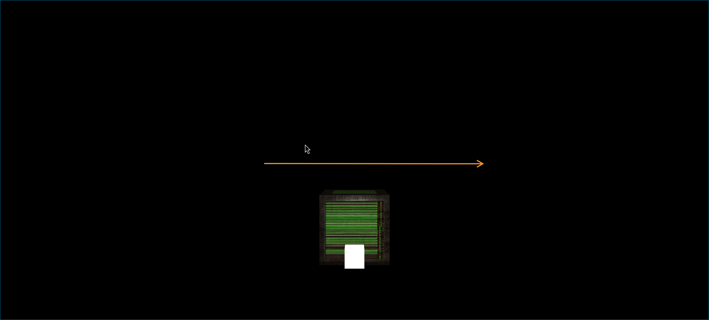

Explaination: The issue here is that i used `GL_CLAMP_TO_EDGE` whereas to get
the effect i was expecting, i should have used `GL_CLAMP_TO_BORDER`. the first
image looks fine because its edge transparent and hence the clamp to edge
effect is also transparent whereas it's visible in the second image as
there's some color on the edge.

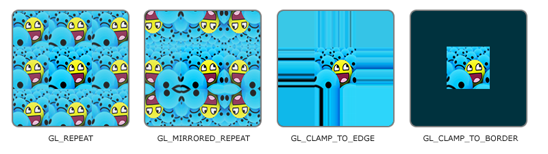

## Light casters
- previously we used point light i.e. source is a single point in space
- but there are several other types of lights
- a source that casts light on object is called a *light caster*.

### directional light
- light source infinitely far away
- light rays come from the same direction, almost parallel irrespective of viewer's position
- independent of the location of light
- eg: sun can be preceived as being a directional light (atleast on the scale of a city/town)
- since light direction is same, lighting calculations will be similar for each object
- *light direction vector* is important to us, not *light position*
- *light direction vector* is from the fragment to the source (has been till now)
- position vectors should have *w* component as 1 for translation and projection to properly apply
- direction vectors should have `w=0` so that translations don't change it
- are directional lights always diffuse? -> no. both diffuse and specular lighting code use that.
- why not directional lights, is there just one directional light per scene? -> probably

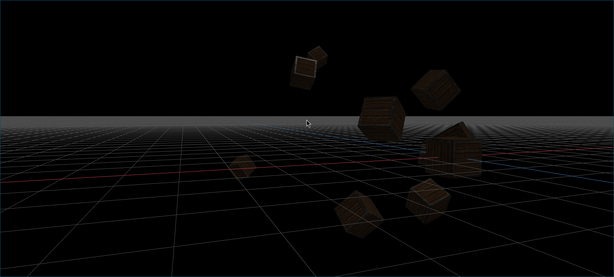

### point lights
- scattered throughout the scene
- has a position in the world, illuminates in all directions
- light rays fade out over distance, eg: lightbulb, torch

#### attenuation
- it's the reduction in light  intensity over distance
- linear function is one way to do it, but that looks fake
- we have *constant*, *linear* and *quadratic* float values to specify attenuation
- applies to all types of lighting, ambient, diffuse & specular. it's like a lighting strength factor
- seems to suggest that attenuation isn't considered for directional lights, like sun dosn't get dimmer with distance ;)
- emission maps must be having their own attenuation values, do they?

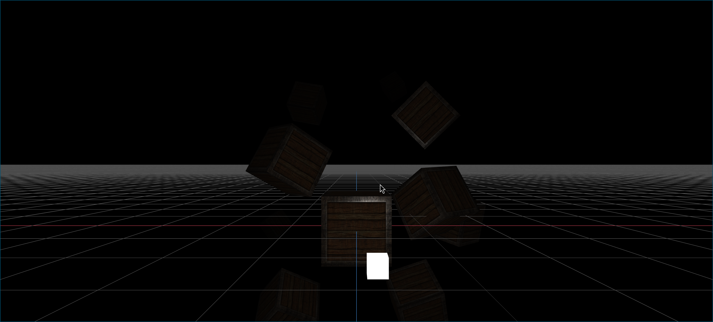
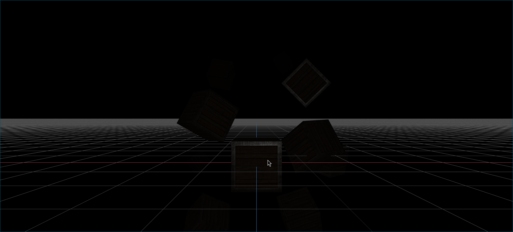

### spotlight
- doesn't shoot light in all directions, only in specific direction
- has a radius within which the objects are visible, eg lamp and torch
- the light rays make a cone with the apex at the light, not a cylinder
- defined by world-space *position*, *direction* and cutoff *angle* (for radius)
- this is similar to xray implementation
- this too will have attenuation, it's a directed point light after all

#### flashlight
- is a spotlight located at the viewer's position
- usually aimed straight ahead from player's perspective
- directed spotlight, with direction and position continuously updated as player changes orientation
- we pass cos of angle instead of angle to make comparisons easy with the dot in fs (arcos is an expensive operation)
- it's to imagine angles and cos/sine values, be aware of their range and how they affect things, confusing names make it worst

##### special goggle effect
- emission map is only visible when fragment falls in the cone of the flashlight effectively acting as a special reality filter
- i remember certin games had some items to identify the right tile to step on, or the box with the treasures
- this can be used in games to also pass on some encoded message and can be a nice easteregg
- the opposite is also as useful, to denoise the lights and find the target, like thermal goggles

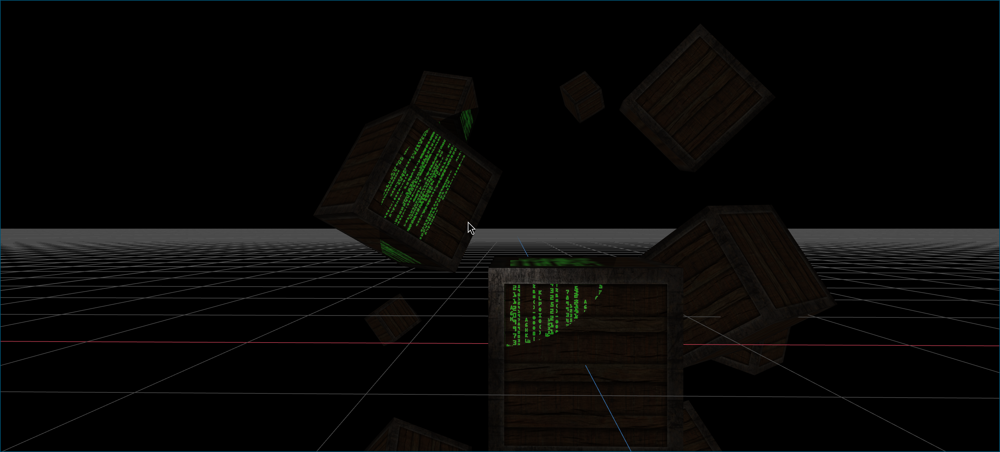
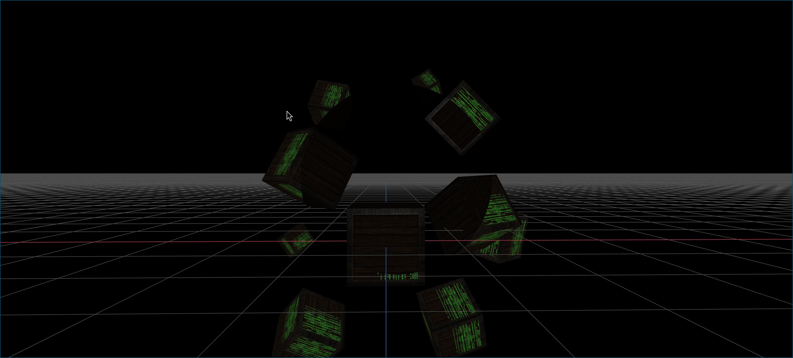

# Playing around

## X-ray implementation
- Sending mouse click to the fragment shader, most of the things should happen there.
- Inspired by [this](https://uploads.disquscdn.com/images/fb236c6b7744f94cc972620040ba2b5556b821ae82d7f01377b1e40693c5ec37.gif) comment on learnopengl.com
- The X-ray circle is drawn in the camera's direction
- To create a circle, I used the same idea used to calculate the specular
  highlight. Using higher shininess value makes the spot smaller, though
  showing it for values  greater than 0 is not a good idea, instead using
  something like 0.5 shows a better spot to work with

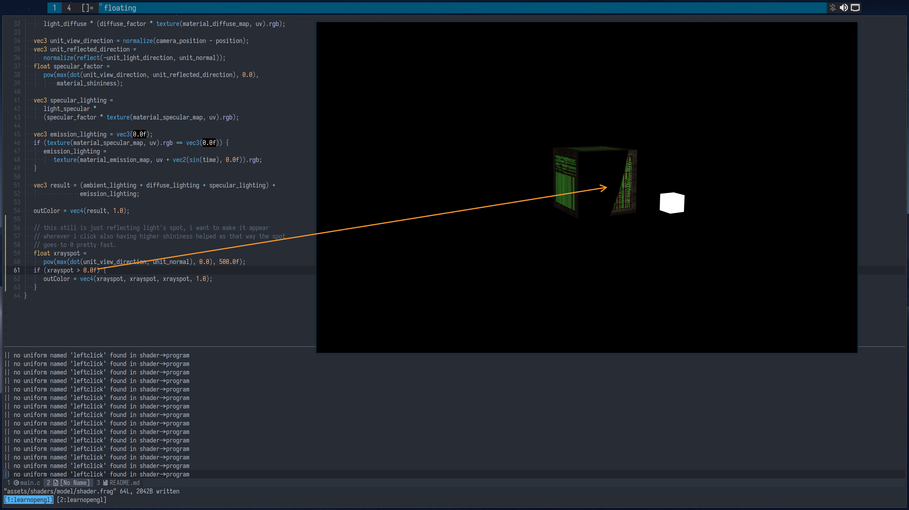
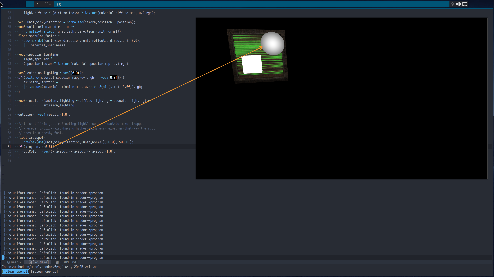

### Xray Implementation details

- I imagined it like a cylinder from the camera to the cube surface
- It's dependent on the camera front direction
- It should also take into account the normal of the face to see if this is
  the face in front of the camera or is it the back face.

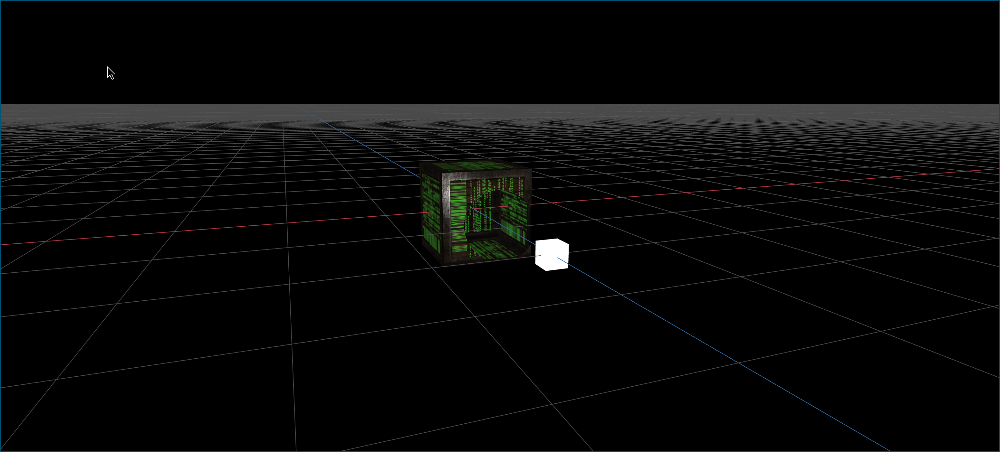
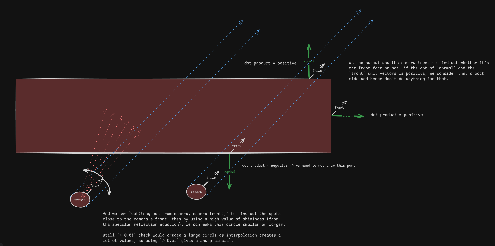

> [!TODO]
> Instead of using discard, we could make the fragment color transparent and
> use blending, this is something to try when I have blending working.

# Debugging

### qrenderdoc

I was trying to add another texture but I don't know how, it just wasn't
showing up. Running the application through qrenderdoc showed that it's
missing i.e. there's some issue with the loading code. qrenderdoc ftw! As
always, it was a typo!
```c
   glActiveTexture(GL_TEXTURE2);
   glBindTexture(GL_TEXTURE3, material_colored_specular_map->texture);
   material_colored_specular_map->texture_index = 2;
```

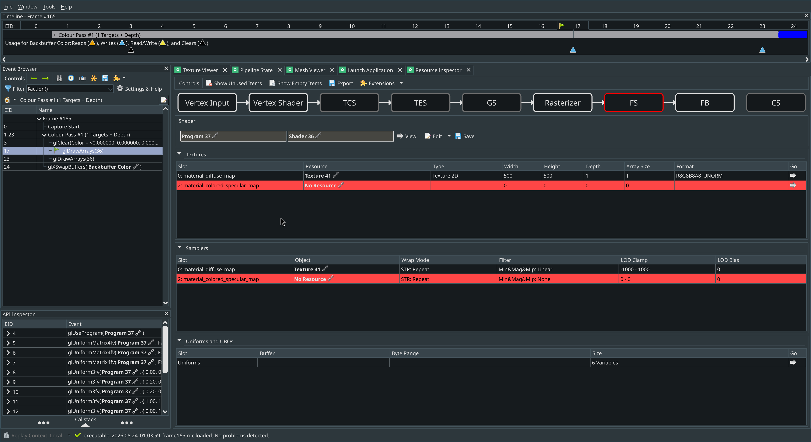
